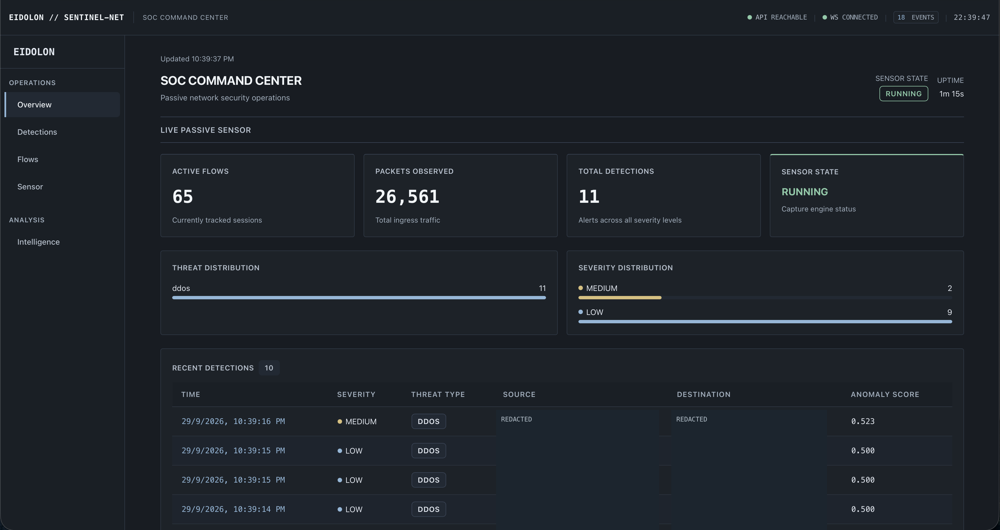
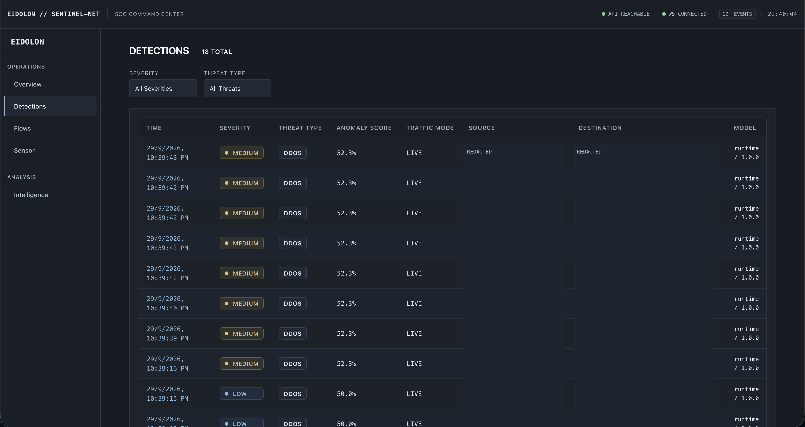
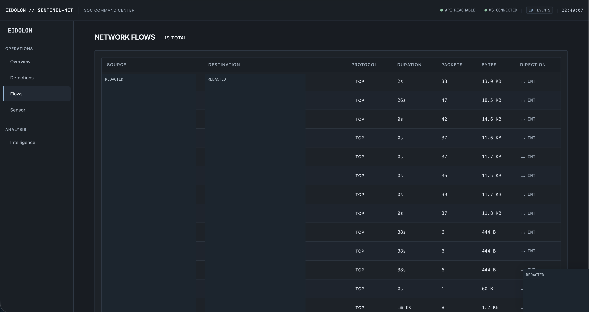
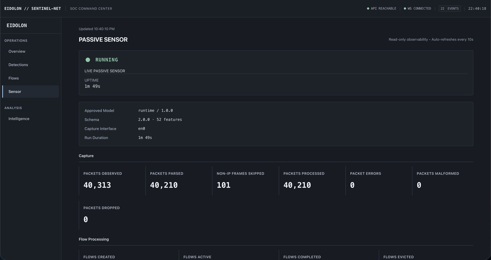
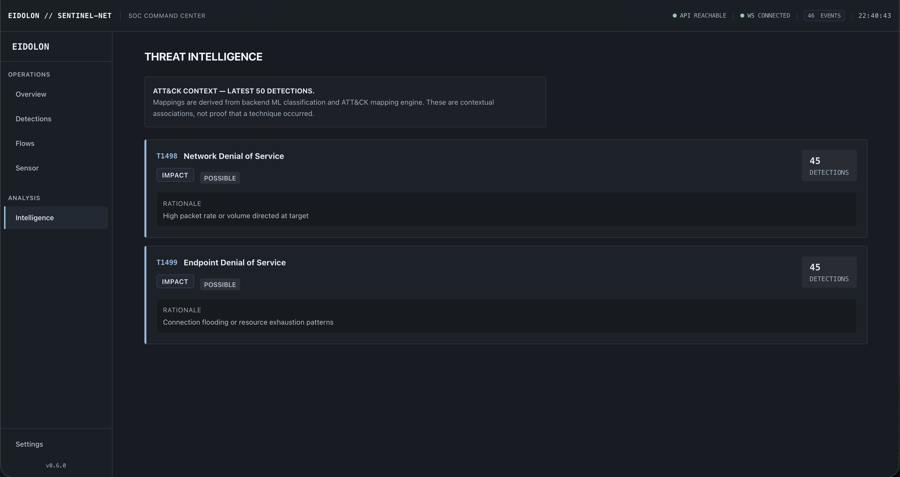
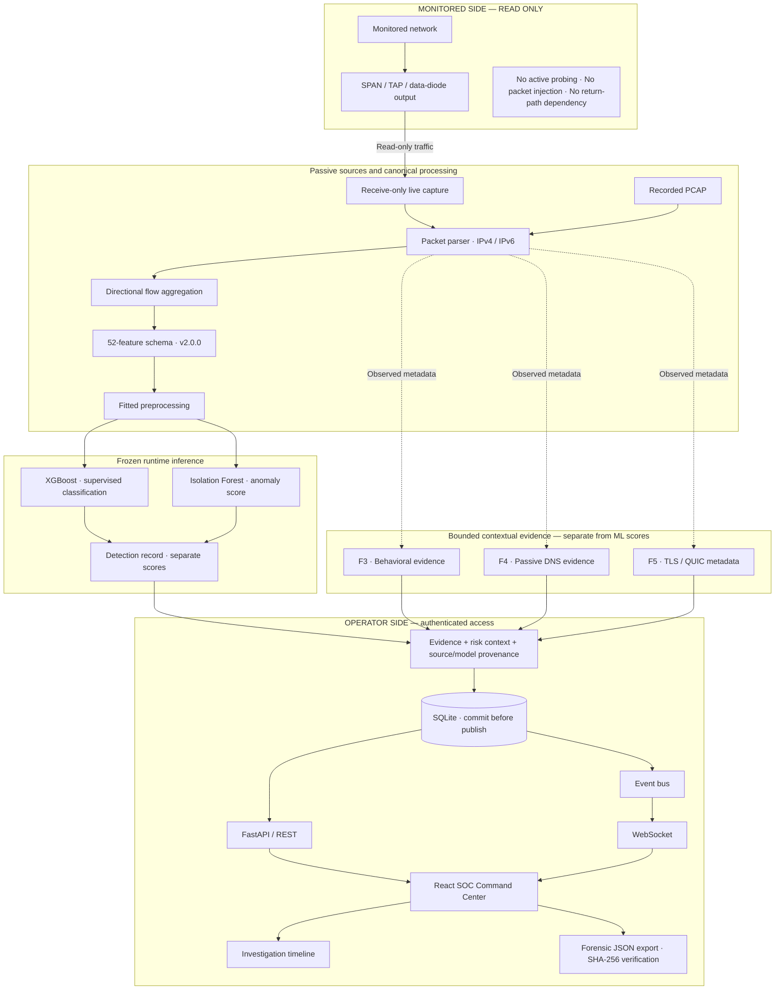
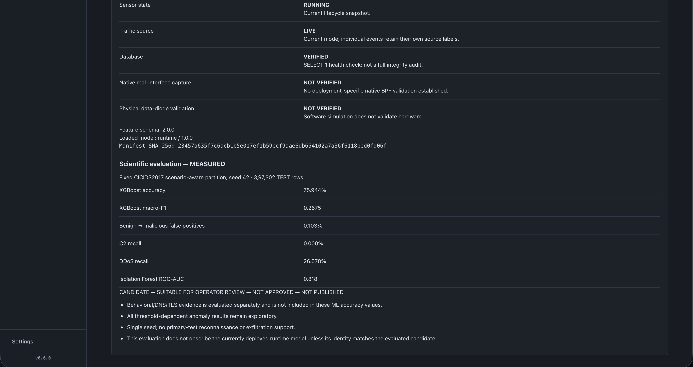

# EIDOLON // SENTINEL-NET

Passive AI-powered cyber-threat detection and investigation for networks that can only be observed in one direction.

**SIH 2026** · Problem **SIH26145** · Organization **NTRO** · Software / Cybersecurity<br>
Team **EIDOLON** · Working research prototype · [MIT License](LICENSE)

Sentinel-NET turns observed traffic into flow features, model outputs and separate contextual evidence that an analyst can investigate. It preserves missing reverse-direction visibility rather than inventing a response. The software is built: deterministic replay and post-freeze native IPv4/IPv6 capture have both exercised the pipeline through the SOC.

## For SIH Judges

| Review question | Start here |
| --- | --- |
| Where is the implementation? | [Repository guide](docs/judge-repository-guide.md) · [Architecture](ARCHITECTURE.md) · [Security boundaries](SECURITY.md) |
| How do I see it working? | [One-command demo](docs/sih-one-command-demo.md) · [Recorded demo walkthrough](docs/judge-demo-runbook.md) |
| What was measured? | [Live passive validation](docs/live-passive-diagnosis.md) · [Scientific report](docs/final-science-report.md) · [Scientific claims](docs/final-science-claims.md) |

Historical documents retain their original scope. Native capture was unverified at the freeze; the later live validation below supersedes that status **for the development Mac**, not for physical data-diode hardware.

## The problem

Traditional security monitoring often benefits from both sides of a session: requests, replies and completed handshakes. One-way visibility removes that assumption. A missing response can mean it was not visible, not that it never happened.

> **Monitored side: read-only.** No active probes, packet injection, active mitigation, return-path dependency or TLS/QUIC payload decryption.

The operator-facing REST API and browser still communicate normally. Passivity applies to observation of the monitored network.

## The idea

**Observe → Extract behavior → Detect → Explain → Help the analyst decide**

A live interface or PCAP feeds packet parsing and flow aggregation. Each completed flow becomes a canonical 52-feature vector, then passes through fitted preprocessing and ML inference. Behavioral, DNS and encrypted-session metadata add distinct evidence. Records are persisted before delivery through REST/WebSocket to the SOC, investigation timeline and JSON export.

## The product



*Live SOC Command Center — passive sensor, flow telemetry and detection state.*

Screenshots are cropped to the application; endpoint identifiers and the screenshot-preview overlay are visibly redacted. Counts, scores and statuses are unchanged. Open a thumbnail for the full-resolution image.

These screenshots show real observed traffic processed by the **synthetic QA runtime**. Displayed DDoS labels, anomaly scores and ATT&CK associations are not confirmed attacks or scientific accuracy evidence.

<table>
  <tr><th>Live detections</th><th>Network flows</th></tr>
  <tr>
    <td><a href="docs/assets/judge/02-live-detections.png"></a></td>
    <td><a href="docs/assets/judge/03-network-flows.png"></a></td>
  </tr>
  <tr><th>Passive sensor</th><th>Threat intelligence</th></tr>
  <tr>
    <td><a href="docs/assets/judge/04-live-passive-sensor.png"></a></td>
    <td><a href="docs/assets/judge/06-threat-intelligence.png"></a></td>
  </tr>
</table>

## Architecture



SPAN/TAP/data-diode output describes the intended observation boundary; **physical hardware data-diode validation is still NOT VERIFIED**. F3/F4/F5 observe metadata alongside canonical processing and enrich records; they do not alter the 52 ML inputs or become a combined attack probability. Export hashes verify bytes, not authorship or legal chain of custody.

### Technical components

| Component | Implementation | Responsibility |
| --- | --- | --- |
| Passive capture | [Scapy / AsyncSniffer](src/sentinel_net/sensor/capture.py) | Receive-only interface input; separate non-IP skip accounting |
| Flow aggregation | [FlowAggregator](src/sentinel_net/flow/aggregator.py) | Directional flow state, completion and idle expiry |
| 52-feature schema | [Schema and extractor](src/sentinel_net/features/) | Shared feature identity and deterministic ordering |
| XGBoost | [Classifier pipeline](src/sentinel_net/detection/classifier.py) | Primary supervised classification |
| Isolation Forest | [Anomaly detector](src/sentinel_net/detection/anomaly.py) | Separate anomaly ranking |
| F3 behavioral evidence | [Streaming engine](src/sentinel_net/intelligence/engine.py) | Bounded temporal and behavioral context |
| F4 DNS | [Passive DNS engine](src/sentinel_net/dns/engine.py) | DNS observations and contextual indicators |
| F5 TLS / QUIC | [Encrypted-session engine](src/sentinel_net/encrypted/engine.py) | Supported handshake metadata, JA3/JA3S and visible QUIC headers |
| SQLite | [aiosqlite storage](src/sentinel_net/storage/database.py) | Durable records, transactions and retention |
| FastAPI / REST | [API routes](src/sentinel_net/api/routes/) | Authenticated, bounded queries |
| WebSocket | [Event bus](src/sentinel_net/sensor/event_bus.py) | Authenticated event delivery with bounded subscribers |
| React SOC | [React / TypeScript frontend](frontend/src/) | Detection, flow, sensor and evidence views |
| Investigation / export | [Analyst operations](src/sentinel_net/operations/investigation.py) | Contextual timeline, provenance and verifiable JSON export |

### One canonical feature schema

| Group | Features |
| --- | ---: |
| Basic | 5 |
| Directional | 6 |
| Packet size | 8 |
| Inter-arrival time | 13 |
| TCP flags | 11 |
| Protocol | 5 |
| Payload metadata | 4 |
| **Total** | **52** |

Schema **2.0.0** is shared across the detection pipeline. Canonical identity is distinct from fitted model input width: the final evaluation's training-only preprocessing retained 41 tree-model columns and 40 linear-model columns. Missing dataset fields were not fabricated. See the [preprocessing record](docs/final-science-report.md).

## Machine learning and scientific results

**Supervised detection:** XGBoost is the primary implementation; Random Forest and Logistic Regression are evaluated baselines. **Anomaly detection:** Isolation Forest produces a separate score. Anomaly scores are not probabilities, and classifier confidence has not been established as calibrated attack probability.

The final evaluation used a fixed, scenario-aware CICIDS2017 partition, seed 42, and **397,302 held-out test rows**. These results belong to the scientific candidate, which remains separate from the judge QA runtime and is **not approved or published to the runtime registry**.

| Measurement | Final result |
| --- | ---: |
| XGBoost accuracy | 0.759440 / 75.944% |
| XGBoost macro-F1 | 0.267512 |
| Benign → malicious operational false-positive rate | 276 / 267851 ≈ 0.103% |
| DDoS supervised recall | 0.266783 / 26.6783% |
| **C2 supervised recall** | **0%** |
| Isolation Forest ROC-AUC | 0.818401 |
| Held-out C2 anomaly ROC-AUC | 0.598615 |
| Held-out DDoS anomaly ROC-AUC | 0.821679 |

The held-out evaluation exposes a genuine generalization weakness for C2 and limited supervised DDoS recall. These results define the next research target rather than being hidden behind aggregate accuracy. C2 was absent from supervised training; macro averages follow the report's explicit label policy. ROC-AUC is a ranking measure, not accuracy, and the held-out-family experiments have separate cohort definitions.

[Full scientific report](docs/final-science-report.md) · [Machine-readable metrics](docs/final-science-metrics.json) · [Claims and exclusions](docs/final-science-claims.md)



*Scientific evaluation shown separately from the loaded QA runtime. The screenshot retains an older native-capture “NOT VERIFIED” label; the later host-specific validation below supersedes it. The physical data-diode status remains NOT VERIFIED.*

## Live Passive Mode

From a provisioned development checkout, on an interface you are authorized to monitor:

```bash
./run-sih-demo.sh --interface en0
```

On the development Mac, macOS BPF and Scapy capture were operational on `en0`. Real IPv4 and IPv6 traffic passed through parsing, flow aggregation, inference, persistence, authenticated REST and WebSocket delivery, and automatic SOC updates. Two validation runs remained **RUNNING for 65.330 and 65.764 seconds**. A separate normal launch opened the browser and delivered three real LIVE events to an authenticated WebSocket subscriber.


This is post-freeze software validation on one host, not physical data-diode validation or a long-duration capacity guarantee. Capture permission must already be provisioned; the launcher does not elevate privileges. [Diagnosis, measured counters and limits](docs/live-passive-diagnosis.md).

## Deterministic judge demo

```bash
./run-sih-demo.sh
```

**191 packets → 72 flows → 72 QA events**

These labels are synthetic QA contract outputs used to verify end-to-end software behavior. They are not scientific accuracy evidence or 72 independently validated attacks.

Both modes reuse the existing credential/bootstrap, frontend startup, browser startup, process ownership and Ctrl+C cleanup. The loopback frontend is `http://127.0.0.1:5174`; the API is `http://127.0.0.1:8010`. Use the newly opened tab, keep the terminal running and stop with Ctrl+C.

**Local prerequisites:** existing Python 3.12+ virtualenv and dependencies, built frontend, free ports and the exact trusted QA bundle in the ignored `.local/sentinel-qa-registry/`. A bare clone does not include that local bundle or scientific datasets. Do not substitute the scientific candidate. [Setup and operator guide](docs/sih-one-command-demo.md) · [Bundle recovery and hashes](docs/qa-runtime-recovery.md).

## Why this design

| Traditional approach / assumption | Sentinel-NET |
| --- | --- |
| Bidirectional session assumptions | Explicit one-way observation; unseen responses remain unseen |
| Active interaction may be available | Observation-only monitored-network path |
| Single prediction output | ML outputs plus separate contextual evidence |
| Alert-only workflow | Detection → investigation → export |
| Opaque demonstration | Deterministic replay plus live passive mode |
| Accuracy-only reporting | Per-class failures and scientific exclusions made explicit |

## Engineering evidence

| Evidence boundary | Recorded validation | Source |
| --- | --- | --- |
| **Frozen SIH release evidence** | 962 backend tests passed; zero failures/skips. 100 frontend tests; strict TypeScript and production build passed, in worktree and clean archive. | [Freeze report](docs/release-freeze-report.md) · [Frozen tag](https://github.com/skandamp-sudo/eidolon-sentinel-net/tree/sih26145-code-freeze-2026-09-25) |
| **Post-freeze live passive validation** | 115 targeted backend/operator tests across two suites (98 + 17); 100 frontend tests; compilation, typecheck and build passed. Two live runs exceeded 65 seconds; replay, cleanup, restart and occupied-port checks passed. | [Live validation](docs/live-passive-diagnosis.md) |

These are distinct runs with different scopes, not one combined test total. The frozen tag remains `sih26145-code-freeze-2026-09-25`; later operational evidence does not rewrite its historical reports.

## Limitations and research targets

- C2 supervised recall is **0%**; DDoS supervised recall is approximately **26.68%**. There is no primary-test support for reconnaissance/exfiltration performance claims.
- Anomaly thresholds remain exploratory. F3/F4/F5 have engineering fixture coverage, not population-level accuracy estimates.
- Physical data-diode hardware is **not validated**. Native capture evidence is specific to the tested Mac/interface and bounded runs.
- JA4 is **not implemented**. Encrypted DNS content is unavailable; TLS application data and QUIC Initial/application payloads are not decrypted. JA3/JA3S are identifiers and context, not malware verdicts.
- The demo runtime is a synthetic QA model. The scientific candidate is never silently promoted into runtime; historical Git availability is not deployment approval.
- Active-flow caps do not strictly bound every long-lived flow's exact packet-size/timestamp histories. Production readiness, arbitrary throughput and national-scale validation are not established.

## Contact

**Skanda M P** · Team EIDOLON<br>
[GitHub](https://github.com/skandamp-sudo) · [LinkedIn](https://www.linkedin.com/in/skanda-m-p-123505434)
